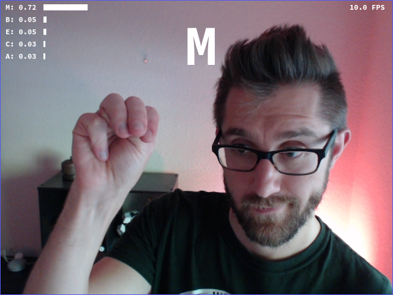
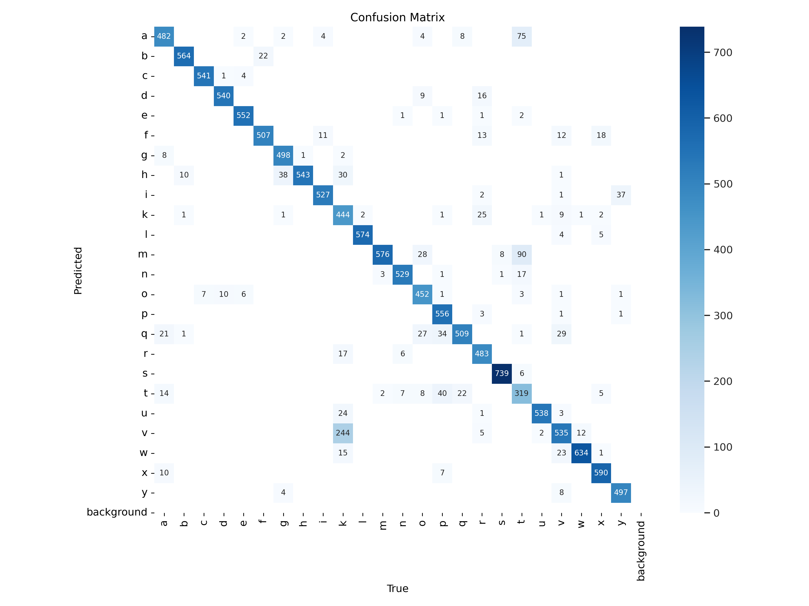

# Drew's MLE Capstone Project

I created a web app that tries to identify [ASL fingerspelling](https://en.wikipedia.org/wiki/Fingerspelling) that you sign into your webcam. 

<p align="center">
  
</p>

Try it out for yourself [here](https://drewzemke.github.io/mle-capstone/)!


## Info

- I completed this project as part of the [UCSD Machine Learning Engineering (MLE)](https://career-bootcamp.extension.ucsd.edu/leads/mec/) course.
You can find my project proposal [here](https://docs.google.com/document/d/1fcbzeiZmmBFA8fMmgTSpWa0aDBTxlG5gilFGgFFFW0E/edit?usp=sharing).

- The app uses a neural network trained from the [YOLOv8](https://docs.ultralytics.com/) image classification model. 
In particular, it was trained from the `yolov8n-cls` ("nano") model.

- The webapp itself is written in React. It uses [`opencv-js`](https://www.npmjs.com/package/@techstark/opencv-js) for image processing 
and [`onnxruntime-web`](https://www.npmjs.com/package/onnxruntime-web) to perform inference using the trained model.

## Datasets

I compiled a training set from two sources:

- The [first dataset](https://www.kaggle.com/datasets/grassknoted/asl-alphabet) consists of roughly 80,000 images of signed letters in different lighting conditions.
  All of the images have a mostly clear background.

- The [second dataset](https://www.kaggle.com/datasets/mrgeislinger/asl-rgb-depth-fingerspelling-spelling-it-out) consists of five subsets of about 13,000 images each. 
  The images in these sets have more normal backgrounds (a room with stuff in it), and some of the images show the faces of the signers. 

The training set consisted of the first dataset plus four of the five subsets from the second. Rather than use the usual train-test split in which a random subset of the data
is witheld for validation, I used the remaining subset from the second dataset for validation. This meant that the validation set had images that are not similar 
to the training data, so the validation performance gave a better sense of how the model would perform on webcam data that was substantially different from the
training data.

A sample of the training data is available in the folder [`yolo/datasets/sample`](yolo/datasets/sample) in this repo. 
You can download the full datasets from the links above.

## Training

I carried out all of the training from the command line, so I don't have much code to share for that stage. (The fact that the `ultralytics` library comes
with a `yolo` command line tool meant I didn't have to interact with Python all that much, for which I am thankful.)
But here's the command I ran to train the model, if you're curious:

```shell
yolo classify train model=yolov8s-cls.pt data=fingerspelling_main epochs=100
```

The model training algorithm ran for a few hours on my home computer. After training, I exported the resulting PyTorch model to the ONNX format
so that I could load it in the app:

```shell
yolo export model=./runs/classify/train/weights/best.pt format=onnx imgsz=320
```


## Performance

The trained model scores an accuracy of 0.926 on the test set. The full set of output artifacts from `yolo` (besides the trained model weights) 
are available in [`yolo/runs/classify/train`](yolo/runs/classify/train).

The confusion matrix is particularly interesting: 

<p align="center">
  
</p>

The large off-diagonal entries of the matrix correspond to similar-looking pairs of signs, so the model 
makes some mistakes that could be considered understandable. 
For example, the matrix indicates that the model struggles to distinguish 'A' from 'T' and 'K' from 'V' -- 
these pairs of signs are visually similar and might reasonably be misidentified by a human as well.


## Potential Improvements

I don't know if I'll ever get around to working on these things, but here's what I would do next for this project in order to improve it.

- The model does not try to identify the letters 'J' and 'Z', since the signs for those letters both involve movement of the hand. 
The next step in developing this model would be to find a way to identify those signs, most likely by feeding a sequence of hand positions into the model.

- More generally, the model should incorporate movement for all of the letters. Real sign language involves movement!

- Use another model to interpret a sequence of signed letters into words and sentences.